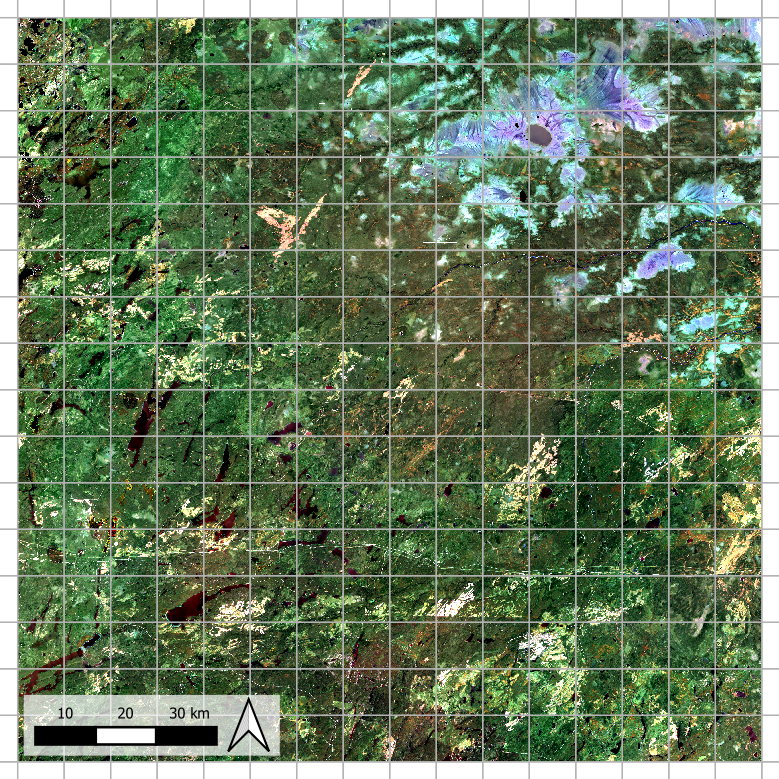
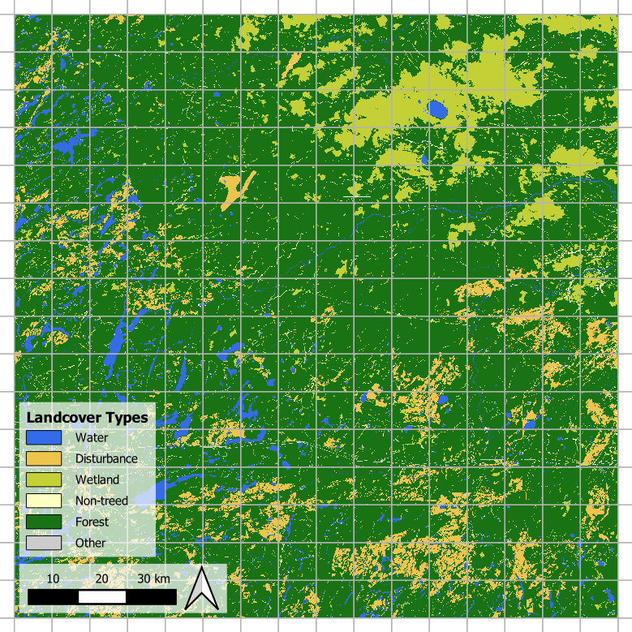
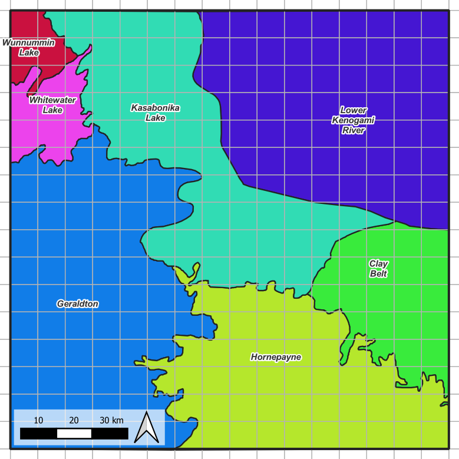

# Raster Data Preparation Guide

[English](./data_preparation.md) | [Français](./data_preparation_fr.md)

Last updated: 2026-03-06

---

## Overview

Effective geospatial machine‑learning workflows begin with careful and consistent data preparation. Before any modeling, training, or experimentation can take place, all input rasters must be standardized in terms of CRS, resolution, extent, and alignment so they behave predictably throughout the pipeline. Ensuring these core properties are harmonized at the start greatly reduces downstream complexity and prevents errors related to mismatched spatial reference systems or misaligned pixels.

A central part of this standardization is the definition of a stable, static, and effectively immutable world grid, which provides the fixed spatial framework used for tiling and deterministic indexing. Once this grid is established, all datasets intended for training, inference, or future production must be snapped or reprojected to match its CRS, pixel size, and origin using external GIS tools such as QGIS, ArcGIS, or GDAL.

This guide outlines the recommended steps for creating a reference raster, enforcing consistent alignment across datasets, and exporting clean, grid‑compatible rasters that form a reliable foundation for all subsequent analysis and modeling.

---

## Contents
- [World Grid Definition](#world-grid-definition)
- [Input Data Raster Specification](#input-data-raster-specification)
  - [Image Raster](#image-raster)
  - [Label Raster](#label-raster)
  - [Domain Raster (Optional)](#domain-raster-optional)
- [Raster Alignment Requirements](#raster-alignment-requirements)
  - [Snapping Workflow in QGIS](#snapping-workflow-in-qgis)
- [Data Configuration JSON](#data-configuration-json)

---

## World Grid Definition

The world grid must be defined in a projected CRS so that tile coordinates and pixel dimensions correspond to linear units (e.g., metres). The starting point is to establish the **project extent**—the full area enclosing both the training region and all intended prediction regions. This extent should be considered **immutable for the entire project**, ensuring that all subsequent data preparation steps reference the same spatial domain.

Once the extent is fixed, users may generate one or more **world grids** as stable, versioned artifacts for different experimental needs. For example, grids may vary by tile size (affecting model field‑of‑view), or may include/omit tile overlap to study edge effects. While grids may change across experiments, they must all remain anchored to the same CRS, resolution, and origin defined by the project extent. This project assumes the rasters are always anchored at **top-left**.

The grid extent can be provided in two ways:

  - Manual definition using a top‑left origin and a specified number of tiles in    the horizontal and vertical directions.
  - Reference‑raster definition (preferred), where a raster created in common GIS tools (QGIS, ArcGIS, GDAL) that supplies the CRS, pixel resolution, extent, and origin to build grid

After project extent is defined, world grids are derived from it during the pipeline (module `landseg.grid`) to form reproducible, versioned tiling schemes used throughout experimentation and production.

[Jump](#tutorial---create-a-reference-raster) to the tutorial on how to create reference raster in QGIS.


**Figure 1**. Extent reference raster creation.

---

## Input Data Raster Specification

### Image Raster
Image rasters used for model training and prediction typically originate from satellite platforms such as *Landsat*, accessed either through the [USGS EarthExplorer portal](https://earthexplorer.usgs.gov/) or through [Google Earth Engine (GEE)](https://earthengine.google.com/). You may choose whichever workflow you are more comfortable with.
>**Note:** scene selection, mosaicking, cloud masking, and other QA/QC decisions remain outside the scope of this framework, as they depend heavily on project‑specific requirements and user expertise.

For GEE users, we recommend exploring the **Best Available Pixel (BAP)** workflow, which provides flexible tools for assembling high‑quality annual composites. A widely adopted implementation is available here: <https://github.com/saveriofrancini/bap>. BAP‑style compositing helps produce temporally stable, cloud‑free rasters suitable for downstream ML models.

Regardless of the processing path, the final image must contain at least the six standard Landsat optical bands, which are required for computing the project’s spectral indices. In addition, users should append a DEM layer, which should be resampled and aligned to the same raster properties as the optical data. Besides
this minimal 7‑channel composite input, you may supply as many additional channels
as applicable.


**Figure 2**. Example image raster.

---

### Label Raster
Label rasters are fully user‑defined, as the labeling system originates from the user’s domain knowledge, data sources, and project objectives. This framework does not prescribe any specific classification scheme; instead, it expects users to supply a raster containing the land‑cover or segmentation labels relevant to their workflow.

Because the project is designed for land‑cover segmentation, the label raster should contain:

  - `Integer` class IDs, representing land‑cover categories.
  - A clearly defined `NoData` value.
  - Any classes the user intends to ignore during training (e.g., water, cloud, unclassified areas).

During data preparation, both `NoData` and user‑specified ignore‑classes are automatically converted into a single ignore‑label index (commonly 255, user‑configurable). This ensures clean handling of invalid or unwanted pixels throughout training and inference.

In many real‑world classification systems, the number of raw land‑cover classes
can be large, imbalanced, or difficult to model effectively in a single pass. To support more manageable and staged training strategies, this framework provides
an optional two‑tier parent–child label hierarchy:

  - Parent classes represent broader, generalized groups.
  - Child classes represent the finer‑scale raw categories that belong to each parent group.

This hierarchy enables workflows such as:

  1. Training an initial model on coarse parent groups to learn broad structure.
  2. Refining the model by focusing on selected parent groups and training on the full child classes associated with them.

If you wish to use this hierarchical approach, you must provide a JSON configuration that defines the parent–child mappings. The format and usage of this configuration are described later in the guide.


**Figure 3**. Example label raster.

---

### Domain Raster (Optional)
A domain raster is an ***optional*** input that can be included when the study benefits from specifying ecological, geographic, or management sub‑regions. The domain can represent any user‑defined partitioning relevant to the project—eco‑zones, administrative boundaries, disturbance regimes, biophysical strata, or other contextual divisions. Although optional for training, a domain raster should ideally **cover both the training region and the intended prediction area** to ensure consistent conditioning across the full project extent.

The domain raster must be **integer‑valued**, with each integer representing a unique domain category. Users do not need to pre‑process these values beyond ensuring their correctness; during training, the framework automatically converts the raw domain raster into the internal representations required by the chosen conditioning strategy (whether used as concatenated inputs, FiLM‑style conditioning, or left as discrete indices).

Because domain processing occurs within the training configuration—not the data‑preparation stage—this guide only requires users to provide a clean, integer‑encoded domain raster aligned to the project extent and reference raster.


**Figure 2**. Example domain raster.

---

## Raster Alignment Requirements
All input rasters—image, label, and optional domain—must be **aligned** to the
project’s reference raster created during world‑grid definition. This ensures that
every raster shares:

- **The same projected CRS**
- **The same pixel resolution**
- **The same pixel origin and alignment**

Snapping to the reference raster guarantees that pixel boundaries match exactly,
which is essential for deterministic tiling, correct label–image pairing, and
reproducible experiments.

All rasters must also fall **entirely within the bounds** of the project extent.
Any data extending beyond the reference raster’s extent will be clipped or
discarded during alignment. Users should therefore crop or reproject their data
appropriately before entering the pipeline.

---

## Data Configuration JSON

The data configuration JSON provides the metadata required for interpreting image bands, raw labels, and optional class groupings. This file must accompany the input rasters and should follow the structure described in the sections below.

### 1. Image Band Specification

Defines the ordering of composite image bands. Band indices must be **zero‑based**
and continuous, since they directly index array channels.

**Example**:
```
{
  "band_map": {
    "dem": 0,
    "blue": 1,
    "green": 2,
    "red": 3,
    "nir": 4,
    "swir1": 5,
    "swir2": 6
  },
}
```

---

### 2. Required Label Configuration

These fields describe the **raw** land‑cover classes as they appear in the label
raster. Label IDs may use any numbering scheme.

**Example**:
```
{
  "ignore_label": 255,          # ignored raw labels to map to this
  "label_num_classes": 8,       # total number of label IDs
  "label_to_ignore": [7, 8],    # labels not to be trained; [] if none
}
```

### 3. Optional Label Parent–Child Hierarchy

This hierarchy allows raw classes to be grouped into broader parent categories
for staged training. This is optional, where keys represent parent class IDs; values list the raw child classes belonging to each parent.

**Example**:
```
{
  "label_reclass_map": {
    "1": [1, 2],
    "2": [3, 4],
    "3": [5, 6]
  }
}
```


### 4. Optional Documentation Fields

These keys are not required for preprocessing but are useful for clarity and
visualization.

**label_class_name:** Human‑readable names for raw label IDs.

**Example**:
```
{
  "label_class_name": {
    "1": "WAT",
    "2": "ISL",
    "3": "FOR",
    ...
    "7": "ROCK",
    "8": "URBAN"
  }
}
```

**label_reclass_name:** Names for parent classes.

**Example**:
```
{
  "label_reclass_name": {
    "1": "water",
    "2": "forest",
    "3": "wetland"
  }
}
```

**label_reclass_color_map:** RGB color values for each parent class. Intended for future visualization tools.

**Example**:
```
{
  "label_reclass_color_map": {
    "1": [51, 108, 230],
    "2": [25, 114, 19],
    "3": [195, 208, 54]
  }
}
```

### Summary

- Required keys:
  `band_map`, `label_num_classes`, `label_to_ignore`, `ignore_label`,
  `label_reclass_map` (if using hierarchy),
- Optional keys:
  `label_class_name`, `label_reclass_name`, `label_reclass_color_map`.
- Band indices must be zero‑based; label IDs may use any numbering convention.

The final JSON must be supplied together with the input rasters to ensure
consistent and reproducible preprocessing across the project.

---

## Appendix

### Tutorial - Create A Reference Raster

For the purpose of this guide, we will create a reference raster in QGIS in the
following steps:

**Task 1 — Define Your Study Area**<br>
**Goal:** Identify the total spatial region to be modeled.
1. Determine the full area covering:
   - Your **training region**, and
   - All **intended prediction regions**.
2. Choose a **projected CRS** (units in metres recommended).

---

**Task 2 — Create an Extent Polygon**<br>
**Goal:** Build a vector outline representing the project extent.
*(Skip if you already have a suitable polygon.)*
1. Open the **Processing Toolbox**.
2. Navigate to: **Vector Geometry → Create layer from extent**
3. Generate a polygon that fully covers your study area.

---

**Task 3 — Convert the Extent Polygon to a Raster**<br>
**Goal:** Produce the reference raster that formalizes project CRS, resolution,
and alignment.
1. Open the **Processing Toolbox** again.
2. Navigate to: **GDAL → Vector Conversion → Rasterize (vector to raster)**
3. Set **Output raster size units** to *Georeferenced units*.
4. Specify:
   - **Horizontal resolution** (e.g., 30 m for Landsat‑scale inputs)
   - **Vertical resolution** (same as above)
5. Ensure the CRS matches your projected CRS.

---

**Task 4 — Save the Reference Raster**<br>
**Goal:** Export the raster that anchors all future grids and data alignment.
- Save the output as something like: **ref_extent.tif**

This file will be used during world‑grid generation and forms the fixed spatial
reference for all aligned rasters.

---

**Result**<br>
You now have a **reference extent raster** that defines:

- The **immutable project extent**
- The **project CRS**
- The **pixel size**
- The **origin and alignment**

All world grids and snapped input rasters will be anchored to this reference.

---

### Tutorial - Snapping Workflow in QGIS

With the reference extent raster prepared, all remaining input rasters (image,
label, and optional domain) must be reprojected and snapped to match it. The
following example workflow uses QGIS:

---

**Task 1 — Load Data**<br>
**Goal:** Bring all relevant rasters into QGIS.
1. Open QGIS.
2. Drag in:
   - The **reference extent raster**.
   - Your **image raster**.
   - Your **label raster**.
   - Your **domain raster** (optional).

---

**Task 2 — Open the Align Rasters Tool**<br>
**Goal:** Use GDAL’s alignment utility inside QGIS.
1. Open the **Processing Toolbox**.
2. Navigate to:
   **GDAL → Raster Alignment → Align rasters**

---

**Task 3 — Set Up Alignment Parameters**<br>
**Goal:** Configure the tool so the input raster snaps exactly to the reference.
1. **Input layer:**
   Select the raster you wish to align (image, label, or domain).

2. **Reference layer:**
   Choose the **reference extent raster**.

3. **Output raster size:**
   - Target resolution: **Layer resolution** (inherits reference pixel size)
   - Target CRS: automatically taken from the reference raster

4. **Output alignment:**
   - Enable **Match pixel alignment**
   - Enable **Clip to reference layer extent**

---
**Task 4 — Save the Aligned Raster**<br>
**Goal:** Export the snapped version.

- Save as:
  - `image_aligned.tif`
  - `labels_aligned.tif`
  - `domain_aligned.tif` (if applicable)

---

**Task 5 — Repeat for All Rasters**<br>
Run the alignment process for each input raster individually.

**Result**<br>
All rasters now share:
- The **same CRS**
- The **same pixel resolution**
- The **same pixel origin and alignment**
- The **same spatial bounds**

They are now fully compatible with the world grid and the rest of the pipeline.

---