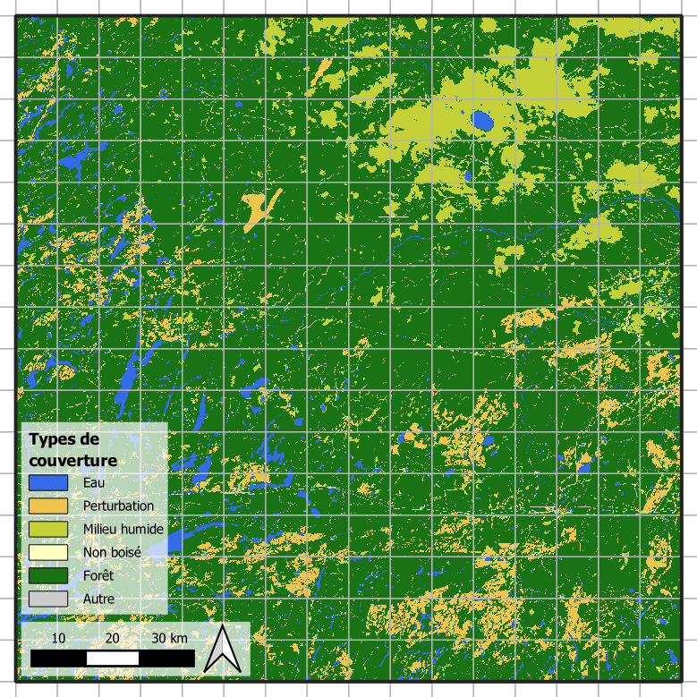
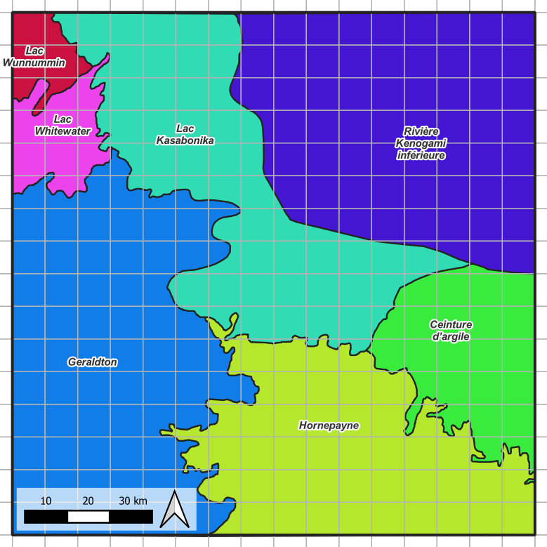

# Guide de préparation des données raster

[English](./data_preparation.md) | [Français](./data_preparation_fr.md)

Dernière mise à jour : 2026-03-06

---

## Aperçu

Des workflows de machine learning géospatiaux efficaces commencent par une préparation des données rigoureuse et cohérente. Avant toute modélisation, tout entraînement ou toute expérimentation, tous les rasters d’entrée doivent être normalisés en termes de SCR, résolution, emprise et alignement afin qu’ils se comportent de manière prévisible tout au long du pipeline. Garantir cette harmonisation de base réduit grandement la complexité en aval et prévient les erreurs liées aux systèmes de référence spatiale incompatibles ou aux pixels mal alignés.

Un élément central de cette normalisation est la définition d’une grille mondiale stable, statique et essentiellement immuable, qui fournit le cadre spatial fixe utilisé pour le découpage et l’indexation déterministe. Une fois cette grille établie, tous les jeux de données destinés à l’entraînement, à l’inférence ou à la production future doivent être ajustés ou reprojetés afin de correspondre à son SCR, sa taille de pixel et son origine à l’aide d’outils SIG externes tels que QGIS, ArcGIS ou GDAL.

Ce guide décrit les étapes recommandées pour créer un raster de référence, imposer un alignement cohérent entre les jeux de données et exporter des rasters propres et compatibles avec la grille afin de constituer une base fiable pour toute analyse ou modélisation ultérieure.

---

## Contenu

- [Définition de la grille mondiale](#définition-de-la-grille-mondiale)
- [Spécification des rasters d’entrée](#spécification-des-rasters-dentrée)
  - [Raster d’image](#raster-dimage)
  - [Raster d’étiquettes](#raster-détiquettes)
  - [Raster de domaine (optionnel)](#raster-de-domaine-optionnel)
- [Exigences d’alignement des rasters](#exigences-dalignement-des-rasters)
- [Fichier JSON de configuration des données](#fichier-json-de-configuration-des-données)

---

## Définition de la grille mondiale

La grille mondiale doit être définie dans un SCR projeté afin que les coordonnées des tuiles et les dimensions des pixels correspondent à des unités linéaires (ex. mètres). Le point de départ consiste à établir **l’emprise du projet** — la zone complète englobant à la fois la région d’entraînement et toutes les régions de prédiction prévues. Cette emprise doit être considérée comme **immuable pour l’ensemble du projet**, garantissant que toutes les étapes ultérieures de préparation des données se réfèrent au même domaine spatial.

Une fois l’emprise fixée, les utilisateurs peuvent générer une ou plusieurs **grilles mondiales** comme artefacts stables et versionnés pour répondre à différents besoins expérimentaux. Par exemple, les grilles peuvent varier selon la taille des tuiles (affectant le champ de vision du modèle) ou inclure/ommettre un recouvrement des tuiles pour étudier les effets de bord. Bien que les grilles puissent changer selon les expériences, elles doivent rester ancrées au même SCR, à la même résolution et à la même origine définis par l’emprise du projet. Ce projet suppose que les rasters sont toujours ancrés en **haut‑gauche**.

L’emprise de la grille peut être fournie de deux manières :
- Définition manuelle utilisant une origine haut‑gauche et un nombre spécifié de tuiles horizontalement et verticalement.
- Définition via un raster de référence (préférée), où un raster créé dans des outils SIG courants (QGIS, ArcGIS, GDAL) fournit le SCR, la résolution des pixels, l’emprise et l’origine pour construire la grille.

Après la définition de l’emprise du projet, les grilles mondiales sont dérivées de celle‑ci dans le pipeline (module `landseg.grid`) afin de former des schémas de tuilage reproductibles et versionnés utilisés pour toute expérimentation et production.

[Aller](#tutoriel---créer-un-raster-de-référence) au tutoriel expliquant comment créer un raster de référence dans QGIS.


**Figure 1**. Création d’un raster de référence d’emprise.

---

## Spécification des rasters d’entrée

### Raster d’image
Les rasters d’image utilisés pour l’entraînement et la prédiction proviennent généralement de plateformes satellitaires comme *Landsat*, accessibles soit via le portail USGS EarthExplorer, soit via Google Earth Engine (GEE). Choisissez le workflow avec lequel vous êtes le plus à l’aise.

**Remarque :** la sélection de scènes, la mosaïque, le masquage nuageux et autres décisions de QA/QC ne sont pas couvertes dans ce cadre, car elles dépendent fortement des besoins du projet et de l’expertise de l’utilisateur.

Pour les utilisateurs GEE, nous recommandons d’explorer le workflow **Best Available Pixel (BAP)**, qui fournit des outils pour produire des composites annuels de haute qualité. Une implémentation largement adoptée est disponible ici : https://github.com/saveriofrancini/bap. Le compositing BAP permet de produire des rasters stables dans le temps et sans nuages, adaptés aux modèles de ML.

Quel que soit le chemin de traitement, l’image finale doit contenir au moins les six bandes optiques Landsat standard, nécessaires au calcul des indices spectraux du projet. Les utilisateurs doivent également ajouter une couche MNT, reséchantillonnée et alignée aux mêmes propriétés raster que les données optiques. En plus de ce composite minimal à 7 canaux, vous pouvez ajouter d'autres canaux.



**Figure 2**. Exemple de raster d’image.

---

### Raster d’étiquettes
Les rasters d’étiquettes sont entièrement définis par l’utilisateur, selon sa connaissance du domaine, ses sources de données et les objectifs du projet. Ce cadre ne prescrit aucun schéma de classification spécifique : il attend simplement un raster contenant les étiquettes de couverture terrestre ou de segmentation pertinentes pour votre workflow.

Comme le projet est conçu pour la segmentation de couverture terrestre, le raster d’étiquettes doit contenir :
- Des IDs de classes de type `Integer`.
- Une valeur `NoData` clairement définie.
- Toute classe que l’utilisateur souhaite ignorer durant l’entraînement.

Durant la préparation des données, les valeurs `NoData` et les classes ignorées sont automatiquement converties en un seul label d’ignorance (généralement 255, configurable). Cela garantit une gestion propre des pixels non valides durant l’entraînement et l’inférence.

De nombreux systèmes de classification réels comportent un nombre de classes élevé ou déséquilibré. Pour permettre des stratégies d’entraînement plus gérables, ce cadre propose une hiérarchie optionnelle parent–enfant :
- Les classes parent sont des groupes plus larges.
- Les classes enfant sont les catégories fines appartenant à chaque parent.

Cette hiérarchie permet notamment :
1. D’entraîner un modèle initial sur des groupes parent pour apprendre la structure générale.
2. De raffiner le modèle en se concentrant sur certains parents et leurs classes enfant.

Si vous souhaitez utiliser cette approche hiérarchique, fournissez un fichier JSON définissant les relations parent–enfant.


**Figure 3**. Exemple de raster d’étiquettes.

---

### Raster de domaine (optionnel)
Le raster de domaine est **optionnel** et peut être inclus lorsque l’étude bénéficie de la définition de sous‑régions écologiques, géographiques ou de gestion. Le domaine peut représenter toute partition pertinente — écozones, limites administratives, régimes de perturbation, strates biophysiques, etc.

Le raster de domaine doit être **entier**, chaque valeur entière représentant une catégorie de domaine. Aucune pré‑transformation n’est nécessaire : durant l’entraînement, le framework convertit automatiquement le raster de domaine brut vers les représentations internes selon la stratégie de conditionnement choisie.



**Figure 4**. Exemple de raster de domaine.

---

## Exigences d’alignement des rasters

Tous les rasters d’entrée — image, étiquettes et domaine optionnel — doivent être **alignés** au raster de référence. Cela garantit qu’ils partagent :
- Le **même SCR projeté**
- La **même résolution de pixel**
- La **même origine et le même alignement**

Tous les rasters doivent aussi être entièrement **inclus dans l’emprise** du projet.

[Aller](#tutoriel---workflow-dalignement-dans-qgis) au tutoriel sur l’alignement des rasters dans QGIS.

---

## Fichier JSON de configuration des données

Ce fichier JSON accompagne les rasters d’entrée. Il définit l’ordre des bandes, le comportement des étiquettes et, éventuellement, les groupes parent–enfant.

### Champs obligatoires
(Key / Purpose / Notes — Conservés sans traduction pour stabilité technique)

| Key | Purpose (FR) | Notes (FR) |
|-----|--------------|------------|
| band_map | Définit l’ordre des bandes de l’image composite | Doit être basé sur une indexation à partir de 0 |
| label_num_classes | Nombre d’identifiants bruts de labels | Tout schéma de numérotation est accepté |
| label_to_ignore | Labels bruts à exclure | Sera remappé vers ignore_label |
| ignore_label | Identifiant unifié de la classe ignorée | Typiquement 255 |
| label_reclass_map | Regroupement parent→enfant des classes (optionnel) | Permet l’apprentissage hiérarchique |

**Exemple:**
```json
{
  "band_map": {
    "dem": 0, "blue": 1, "green": 2,
    "red": 3, "nir": 4, "swir1": 5, "swir2": 6
  },
  "label_num_classes": 8,
  "label_to_ignore": [7, 8],
  "ignore_label": 255,
  "label_reclass_map": {
    "1": [1, 2],
    "2": [3, 4],
    "3": [5, 6]
  }
}
```

### Champs optionnels de documentation
Ces éléments améliorent l’interprétabilité et la visualisation, mais ne sont pas requis par le pipeline de prétraitement.

| Key | Purpose (FR) |
|-----|--------------|
| label_class_name        | Noms lisibles par l’humain pour les labels bruts     |
| label_reclass_name      | Noms lisibles par l’humain pour les classes parent   |
| label_reclass_color_map | Couleurs RVB pour les classes parent (aperçu visuel) |

**Exemple:**
```json
{
  "label_class_name": {
    "1": "ISL", "2": "WAT",
    "3": "FOR_NEW", "4": "FOR_OLD",
    "5": "TMS", "6": "OMS",
    "7": "RCK", "8": "UCL"
  },
  "label_reclass_name": {
    "1": "water",
    "2": "forest",
    "3": "wetland"
  },
  "label_reclass_color_map": {
    "1": [51, 108, 230],
    "2": [25, 114, 19],
    "3": [195, 208, 54]
  }
}
```

**Règles clés**
  - Les indices de bandes doivent commencer à 0.
  - Les identifiants de labels peuvent utiliser n’importe quel système de numérotation.
  - label_reclass_map est optionnel; à utiliser seulement si vous exploitez un entraînement hiérarchique.
  - Les champs comme dem_pad sont volontairement omis (en révision).

**Résumé**

Vous avez seulement besoin de :
  - `band_map`
  - `label_num_classes`
  - `label_to_ignore`
  - `ignore_label`
  - `label_reclass_map` (optionnel)

Tout le reste est un métadonné facultatif visant à améliorer la lisibilité ou la visualisation.

---

## Annexe

### Tutoriel - Créer un Raster de Référence
Dans ce guide, nous allons créer un raster de référence dans QGIS en suivant les étapes suivantes :

**Tâche 1 — Définir votre zone d’étude**
**Objectif :** Identifier la zone spatiale totale à modéliser.
1. Déterminer l’ensemble de la zone couvrant :
   - Votre **région d’entraînement**, et
   - Toutes les **régions prévues pour la prédiction**.
2. Choisir un **SCR projeté** (unités en mètres recommandées).

---

**Tâche 2 — Créer un polygone d’étendue**
**Objectif :** Construire un polygone vectoriel représentant l’étendue du projet.
*(À sauter si vous avez déjà un polygone approprié.)*
1. Ouvrir la **Boîte à outils de traitements**.
2. Naviguer vers : **Vectoriel → Géométrie vectorielle → Créer une couche à partir de l’étendue**
3. Générer un polygone couvrant entièrement votre zone d’étude.

---

**Tâche 3 — Convertir le polygone d’étendue en raster**
**Objectif :** Produire le raster de référence définissant le SCR du projet, la résolution et l’alignement.
1. Rouvrir la **Boîte à outils de traitements**.
2. Aller à : **GDAL → Conversion vectorielle → Rasteriser (vecteur vers raster)**
3. Définir **Unités de taille du raster de sortie** sur *Unités géoréférencées*.
4. Spécifier :
   - **Résolution horizontale** (ex. 30 m pour des données de type Landsat)
   - **Résolution verticale** (même valeur que ci‑dessus)
5. Vérifier que le SCR correspond à votre SCR projeté.

---

**Tâche 4 — Enregistrer le raster de référence**
**Objectif :** Exporter le raster qui servira d’ancrage à toutes les futures grilles et à l’alignement des données.
- Enregistrer la sortie sous un nom tel que : **ref_extent.tif**

Ce fichier sera utilisé lors de la génération de la grille mondiale et constituera la référence spatiale fixe pour tous les rasters alignés.

---

**Résultat**
Vous disposez maintenant d’un **raster d’étendue de référence** qui définit :

- L’**étendue immuable du projet**
- Le **SCR du projet**
- La **taille des pixels**
- L’**origine et l’alignement**

Toutes les grilles mondiales et tous les rasters d’entrée ajustés seront ancrés à cette référence.

---

### Tutoriel - Workflow d’Alignement dans QGIS
Avec le raster d’étendue de référence prêt, tous les rasters d’entrée restants (image, labels et domaine optionnel) doivent être reprojetés et ajustés pour correspondre à ce dernier. Le workflow suivant montre comment le faire dans QGIS :

---

**Tâche 1 — Charger les données**
**Objectif :** Charger tous les rasters pertinents dans QGIS.
1. Ouvrir QGIS.
2. Glisser‑déposer :
   - Le **raster d’étendue de référence**
   - Votre **raster d’image**
   - Votre **raster de labels**
   - Votre **raster de domaine** (optionnel)

---

**Tâche 2 — Ouvrir l’outil Align Rasters**
**Objectif :** Utiliser l’outil d’alignement GDAL intégré dans QGIS.
1. Ouvrir la **Boîte à outils de traitements**.
2. Naviguer vers :
   **GDAL → Alignement de raster → Aligner les rasters**

---

**Tâche 3 — Configurer les paramètres d’alignement**
**Objectif :** Configurer l’outil pour que le raster d’entrée s’aligne exactement sur la référence.
1. **Couche en entrée :**
   Sélectionner le raster à aligner (image, labels ou domaine).

2. **Couche de référence :**
   Choisir le **raster d’étendue de référence**.

3. **Taille du raster de sortie :**
   - Résolution cible : **Résolution de la couche** (reprend la taille de pixel de la référence)
   - SCR cible : automatiquement hérité du raster de référence

4. **Alignement de sortie :**
   - Activer **Faire correspondre l’alignement des pixels**
   - Activer **Découper selon l’étendue de la couche de référence**

---

**Tâche 4 — Enregistrer le raster aligné**
**Objectif :** Exporter la version ajustée.
- Enregistrer sous :
  - `image_aligned.tif`
  - `labels_aligned.tif`
  - `domain_aligned.tif` (si applicable)

---

**Tâche 5 — Répéter pour tous les rasters**
Répéter le processus d’alignement pour chaque raster d’entrée individuellement.

---

**Résultat**
Tous les rasters partagent désormais :

- Le **même SCR**
- La **même résolution de pixel**
- La **même origine et le même alignement**
- Les **mêmes limites spatiales**

Ils sont maintenant totalement compatibles avec la grille mondiale et le reste du pipeline.

---